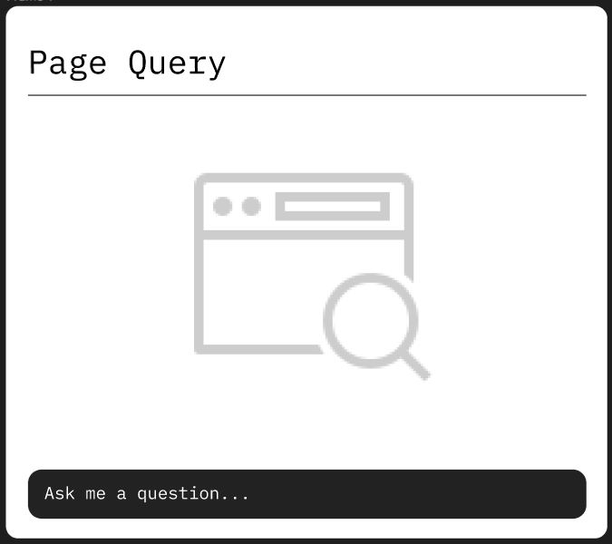
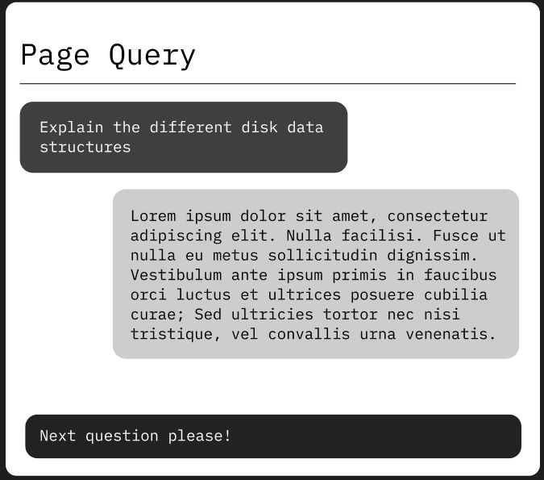

# Table of Contents 
- [Overview](#overview)
- [Links](#links)
- [Features](#features)
- [Challenges we faced](#challenges-we-faced)
- [Tech Stack](#tech-stack)
- [Authors](#authors)
- [Screenshots](#screenshots)

## Overview
The Q&A Browser Extension - PageQuery is an innovative tool that enables you to answer questions directly from web pages. With an average limit of 5000 words per web page, you can provide comprehensive and detailed responses. The extension also includes a history of the chat feature, allowing you to revisit previous conversations for reference.

## Links
- Backend Host Flask: [View Host](https://huggingface.co/spaces/Th3BossC/qnaBackend/tree/main)
- Backend Host Django: [View Host](https://huggingface.co/spaces/arshiyahafis/WebDigest/tree/main)
- Installing the Extension: [Frontend Source code](https://github.com/AltoTenor/WebDigest/tree/main/frontend/README.md)
- Using the Backend: [Flask](https://github.com/AltoTenor/WebDigest/blob/main/backendCode_flask/README.md)
[Django](https://github.com/AltoTenor/WebDigest/blob/main/backendFinalBuild_django/README.md)

## Features
- **Answer Questions:** Seamlessly provide answers to questions found on web pages. Your responses can be up to 500 words long, ensuring thorough explanations.

- **Chat History:** The extension maintains a chat history, allowing you to review past conversations, answers, and interactions. This feature enhances your ability to engage with users and maintain context.

- **Enhanced User Experience:** Customize your interactions and user experience by adding your own features to the extension. Innovate and tailor the tool to your specific needs.

- **Completely Open Source:** Both our backend and frontend solutions are separate and open source, allowing anyone to create their own UI for our API service, or their own API service for our Chrome extension UI, and seamlessly connect them as need be.

## Challenges We faced
- Working with a huge Large language model was hectic as we couldn't find a good hosting service which was free as well as powerful enough to host our model.
- Due to a lack of time to figure out the issue, we tried a lot of approaches, including going as far as changing the backend framework from Django to Flask.
- After painstaking debugging, we found the issue which prevented the hosting service from building our model properly, after fixing it we were left with 2 working backend solutions.
- We have provided both of our backend solutions, along with the frontend source code, for anyone to choose from and build upon.

## Tech Stack
**Client:** AngularJS, HTML, CSS, JavaScript

**Server:** Flask/Django, Python

**Model:** Pretrained LLM transformer model flan-t5

**Design and Reference:** Figma, Dribble

## Authors
- Diljith P D - [Portfolio](https://th3bossc.github.io/Portfolio)
- Aritro Ghosh - [github](https://github.com/AltoTenor)
- Arshiya Hafis - [github](https://github.com/ArshiyaHafis)
- Chandrakant V B - [github](https://github.com/CVB003)

## Screenshots

